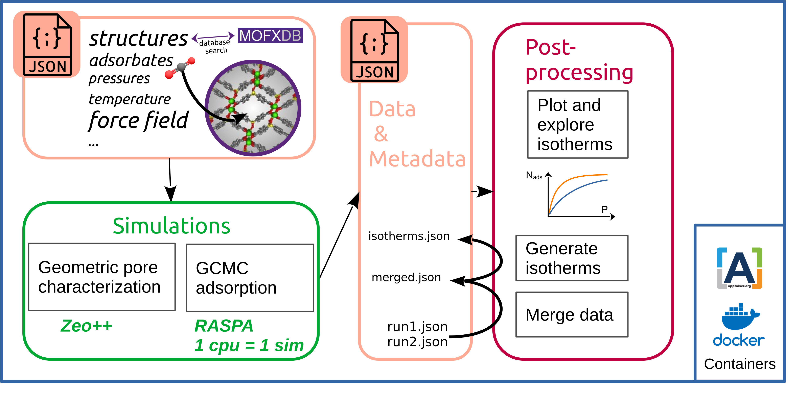

# simple-adsorption-workflow

Automating RASPA simulations and analysis for adsorption studies using a minimalist workflow with JSON input/output, CoRE MOF database integration, isotherm generation, prospecting tools and plot examples.

## Description

This package provides a demonstrative workflow for automating RASPA simulations for adsorption studies. It allows users to specify simulation parameters and default settings through a JSON file, and generates directories with input files and submission scripts for RASPA. The program retrieves CIF files from the CoRE MOF database and stores isotherms as CSV or JSON files. This workflow aims to streamline the simulations and simplify the analysis process, making it easier to study adsorption phenomena.

Part of the code presented here was heavily inspired by [RASPA python wrapper](https://github.com/WilmerLab/raspa2/tree/sensor_array_mof_adsorption/python), and been adapted to meet the workflow architecture.

## Install

### With Apptainer

For a ready-to-use solution of this workflow, one can use an apptainer image (similar to Docker), further information can be found on the [DIAMOND website](https://diamond-diadem.github.io/workflows/saw/tutorial/).

### With Conda

For development purposes, use the following instructions :

- Create a conda environment with Python 3.9:
```bash
conda create -n simple-adsorption-workflow python=3.9
conda activate simple-adsorption-workflow
```
- Build and install RASPA from source (using version 2.0.48)
```
git clone https://github.com/iRASPA/RASPA2.git
cd RASPA2
git checkout v2.0.48
```
See the install section in the original [documentation](https://github.com/iRASPA/RASPA2) to install from source.

- Install Openbabel using conda
```bash
conda install -c conda-forge openbabel
```

- Use pip to install the rest of the libraries listed in `requirements.txt` into the conda environment:
```bash
pip install -r requirements.txt
```

- Download and compile Zeo++ at [http://www.zeoplusplus.org/download.html](http://www.zeoplusplus.org/download.html). To inform the workflow of the executable `network` path, modify the corresponding line in `set_environment`:
```
export ZEO_DIR=/opt/zeo++-0.3
```

- Define the environment variables:
```bash
source set_environment
```

Optionally, you can set up this recovering of the environment variables at each activation of the conda environment:

```bash
mkdir -p $CONDA_PREFIX/etc/conda/activate.d/
printf "%s\n" "#/bin/sh" "source $PWD/set_environment" > $CONDA_PREFIX/etc/conda/activate.d/simple-adsorption-workflow_set_env.sh
chmod +x $CONDA_PREFIX/etc/conda/activate.d/simple-adsorption-workflow_set_env.sh
```

In the case you are running in a fish shell, `set_environment_fish` should be used  in the commands above instead of `set_environment`.

## User input (JSON file)

This is the standard format of the `input.json` file to be provided by the user:

```
{
    "parameters":
        {
        "structure":["MIBQAR","VOGTIV"],
        "molecule_name": ["N2", "CO2"],
        "pressure": [10,1E6],
        "npoints":5,
        "temperature": [298.15],
        "charge_method":["EQeq"]
        }
    "defaults":
        {
            "forcefield":"ExampleMOFsForceField",
            "init_cycles":10,
            "cycles":20,
            "print_every":5,
            "grid_use":"yes"
        }
}
```
In the field `parameters`, the keywords refer to the specific workflow inputs :

- `structure` : six-letter CSD codes to identify the material (e.g., `MIBQAR`)
- `molecule_name` : guest molecules (e.g., N2).
- `temperature` : temperatures in K
- `pressure` : a pressure range, minimum and maximum pressures
- `npoints` : number of pressure points linearly distributed in the pressure range
- `charge_method` : methods for charge assignment (actual : 'None' or 'EQeq')

In the field `defaults`, the keywords refer to RASPA default parameters, see more details about RASPA input file in a further section.

> Note : `parameters` and `defaults` have been divided for the following purpose : if there are lists of parameters in the `parameters` field (e.g., multiple materials), the program will generate simulation folders for each unique combination of `parameters`.


In this workflow, there are certain restrictions in order to keep the simulations simple and make some assumptions:
- The material must be available in the CoreMOF database, accessible through the MOFXDB database (https://github.com/n8ta/mofdb-client).
- The guest molecule should be a rare gas such as argon (Ar) or xenon (Xe), or it should have a spherical model, like nitrogen (N2), methane (CH4), or sulfur hexafluoride (SF6).
- No electrostatic interactions are considered in the simulations.

These restrictions and assumptions aim to streamline the simulations and simplify the modeling process.

## Workflow example

### Run simulations
```Bash
python $PACKAGE_DIR/saw.py run
```
To specify input and output locations :
```bash
python $PACKAGE_DIR/saw.py run -i <path/to/myinput>.json -o <path/to/data/directory>
```
By default, when the flag `-o` is not provided,   a new directory will be created with the following formatting name : `./<Date>_<Time>_<Runtype>/` .
The run type <Runtype> is `data` for normal runs and `<name_of_test>` for tests cases.

### Merge outputs from two independent runs

```
python $PACKAGE_DIR/saw.py merge -i run<index1>.json run<index2>.json -o ./
```
Two files will be created :
- `run_merged.json` : the workflow file with all single-point outputs
- `isotherms.json` : the isotherms file


### Use a GUI to create the input file of the workflow
```
python $PACKAGE_DIR/saw.py input
```

## Workflow diagram

The schematic diagram (Fig. 1) outlines the primary functions executed within the workflow:

- **Parsing Input File:** The input file undergoes parsing and interpretation to generate simulation input files. Error messages are generated if the structure names are not found in the database or if gas names do not match the default ones in RASPA.

- **Calculations:** Two types of calculations are performed:
  - Grand Canonical Monte Carlo simulations using RASPA.
  - Pore characterization of the structures using Zeo++.

- **Storage of Output Data:** The resulting gas uptakes, along with input data and metadata from RASPA, are stored in a common `run<runID>.json` file.

- **Data Transformation:** Output data can be converted into more user-friendly array-like tables, facilitating the plotting of isotherms.

- **Data Merging:** Various workflow outputs can be merged, enabling the retrieval of isotherms based on group selections using both data and metadata.

  
<p align="center">
  
</p>
<p align="center"><i>Figure 1: Diagram of the workflow. </i></p>

## Tests

### Recover isotherms from CSV
It runs 20 simulations on RASPA and compute geometric features using ZEO++, then stores the results in CSV files. It then reconstructs the isotherms curves from the simulation results and compares line by line all isotherms files from pre-computed data found in the package repository. The geometrical features are also stored in a CSV format, and 
To run it, use `-t` or `--test-isotherms-csv` flags: 
```bash
python $PACKAGE_DIR/saw.py run -t
```
The input file used here is located in `$PACKAGE_DIR/tests/test_isotherms_csv/`.

### Recover isotherms from JSON

It runs 20 simulations on RASPA then stores the results in a single JSON file. It then reconstructs the isotherms and store the results in JSON format.

To run it, use the `-t2` or `--test-isotherm-json` flag : 
```bash
python $PACKAGE_DIR/saw.py run -t2
```
The input file used here is located in `$PACKAGE_DIR/tests/test_isotherms_json/`.

### Merge and plot isotherms from two workflow runs

To run it, use the `-t3` or `--test-merge-json` flag : 
```bash
python $PACKAGE_DIR/saw.py merge -t3
```
The json files containing the data to be merged (single pressure data points) are located in `$PACKAGE_DIR/tests/test_merge_json/gcmc/`.


### Calculate the partial charges using the EQeq method
```bash
python $PACKAGE_DIR/saw.py run --test-charges
```
The output of the EQeq code should appear with the atom types and the atomic experimental properties used for the calibration of the method.

### Run simulations on user CIF
```bash
python $PACKAGE_DIR/saw.py run --test-cif-local-directory
```
This test will copy the corresponding input files to run simulations from the CIF files found in the current directory (or subdirectory)

## Documentation

### JSON input

- `structure` :  a list of MOF crystal identifiers.
  The input parser employs MOFXDB API, so for now the only structures that can be used are structures found in CoREMOF (2014 or 2019) and h-MOF. 
  By default, the input parser reads only a 6-letter refcode (CSD format). It then filters out only the structures found in `coremof-2019` database. The CIF corresponding files will be downloaded in the `./cif` directory at the root of the output directory and will contains files suffixes that indicates the level of curation (e.g. in VOGTIV_clean_h_coremof-2019.cif, `_clean` refers to the deletion of adsorbates species from the original X-crystallography characterization, and `_h` refers to adjustment of the hydrogen atoms)

> Note : one six-letter identifier may result in two structures in the original CORE-MOF database, then all corresponding structures will be added to the list of cifs for further calculations, e.g. : structure=["AHUTIH"] will generate calculations for both files AHUTIH01_clean_coremof-2019.cif  and AHUTIH_clean_coremof-2019.cif.

Users can also supply CIF files in a local archive `./cif`. This option is enabled by setting `database`=`local` in the input JSON file. The `./cif` directory must be located in the current directory.  

> Note : The user is responsible for cleaning the structures he provides. To use the automatic EQeq charge assignment calculation, the CIF format must check the program specifications.
 
- `molecule_name` : a list of gas molecule names. 
By default, the force field for adsorbate molecules is ExampleDefinitions. Therefore a file of the same name must exist in `$RASPA_DIR/share/raspa/molecules/ExampleDefinitions`.
- `forcefield` : the key name of the predefined force field in RASPA. The force field are stored in `$RASPA_DIR/share/raspa/forcefield/` and here the list of possible key names :
    - CoreShellSchroderSauer
    - Dubbeldam2007FlexibleIRMOF-1
    - Dubbeldam2007FlexibleIRMOF-10
    - Dubbeldam2007FlexibleIRMOF-16
    - ExampleMOFsForceField
    - ExampleMoleculeForceField
    - ExampleZeolitesForceField
    - Nicholas

- others parameters in section `defaults` : all other parameters that can be modified through a template.
  The workflow uses by default the following template for RASPA inputs, all keys in brackets can be modified from JSON input file:
```
    SimulationType                {simulation_type}
    NumberOfCycles                {cycles}
    NumberOfInitializationCycles  {init_cycles}
    PrintEvery                    {print_every}
    RestartFile                   no

    Forcefield                    {forcefield}
    CutOff                        12
    ChargeMethod                  Ewald
    EwaldPrecision                1e-6
    UseChargesFromCIFFile         {charges_from_cif}

    Framework                     0
    FrameworkName                 {structure}
    InputFileType                 {input_file_type}
    UnitCells                     {a} {b} {c}
    HeliumVoidFraction            {helium_void_fraction}
    ExternalTemperature           {temperature}
    ExternalPressure              {pressure}

    Movies                        no
    WriteMoviesEvery              100

    NumberOfGrids                 {grid_n_atoms}
    GridTypes                     {grid_atoms}
    SpacingVDWGrid                {grid_spacing}
    SpacingCoulombGrid            {grid_spacing}
    UseTabularGrid                {grid_use}

    Component 0 MoleculeName             {molecule_name}
                StartingBead             0
                MoleculeDefinition       ExampleDefinitions
                IdealGasRosenbluthWeight 1.0
                TranslationProbability   1.0
                RotationProbability      1.0
                ReinsertionProbability   1.0
                SwapProbability          1.0
                CreateNumberOfMolecules  0
```
Definitions :
- `{molecule_name}`: The molecule to test for adsorption. A file of the same name must exist in `$RASPA_DIR/share/raspa/molecules/ExampleDefinitions`.
- `{temperature}`: The temperature of the simulation, in Kelvin.
- `{pressure}`: The pressure of the simulation, in Pascals.
- `{helium_void_fraction}`: The helium void fraction of the input structure. Required for excess adsorption back-calculation.
- `{unit_cells}`: The number of unit cells to use, by dimension.
- `{simulation_type}`: The type of simulation to run, defaults to "MonteCarlo".
- `{cycles}`: The number of simulation cycles to run.
- `{init_cycles}`: The number of initialization cycles to run. Defaults to the minimum of cycles / 2 and 10,000.
- `{forcefield}`: The forcefield to use. Name must match a folder in `$RASPA_DIR/share/raspa/forcefield`, which contains the properly named `.def` files.
- `{input_file_type}`: The type of input structure. Assumes cif.
- `{grid_}` : All parameters which refer to pre-calculation of energies on grids.

> Note : In the future, we might let the user provide its own custom templates files to be able to take into account other parameters.

### JSON outputs

In the first version of the workflow, the outputs were stored in CSV files. Since this format is not appropriate to store metadata, we added routines to export all simulation data in a more suitable format, a JSON format. We also add a routine that transform single-pressure-point adsorption to isotherms.

#### Workflow database JSON file

location : `./gcmc/run<runID>.json`

```
{
  "input": {
    "parameters": {
      "structure": ["MIBQAR", "VOGTIV"],
      "molecule_name": ["N2", "CO2"],
      "pressure": [10, 1000000.0],
      "npoints": 5,
      "temperature": [298.15]
    },
    "defaults": {
      "unit_cells": [1, 1, 1],
      "forcefield": "ExampleMOFsForceField",
      "init_cycles": 10,
      "cycles": 20,
      "print_every": 5
    }
  },
  "metadata": {
    "timestamp": "2024-01-15 17:30:42",
    "python_version": "3.9.16",
    "python_compiler": "GCC 11.3.0",
    "os_platform": "Linux-x86_64",
    "os_version": "#40~22.04.1-Ubuntu",
    "os_system": "Linux",
    "os_release": "6.2.0-39-generic",
    "machine": "x86_64",
    "processor": "x86_64",
    "workflow_package_git_hash": "b505d5e63fee21be57836e7041c429b48e7c26dc",
    "cif_source": {
      "database": "mofxdb",
      "version": "dc8a0295db"
    }
  },
  "results": [
    {
        "cycles": 20.0,
        "forcefield": "ExampleMOFsForceField",
        "init_cycles": 10.0,
        "molecule_name": "N2",
        "npoints": 5.0,
        "pressure": 10.0,
        "print_every": 5.0,
        "simkey": "simca3ee227",
        "structure": "MIBQAR16_clean_coremof-2019",
        "temperature": 298.15,
        "unit_cells": "[2, 2, 2]",
        "Pressure(Pa)": 10.0,
        "uptake(cm^3 (STP)/cm^3 framework)": 0.0
    },
    {
        ...
    }
  ]
}
```


#### isotherm JSON file

location : `./gcmc/isotherms.json`

This is just a transformation in the way data is printed in JSON keys, all data are grouped by a set of identical parameters defined as follows : `Pressure(Pa)`, `uptake(cm^3 (STP)/cm^3 framework)`,`simkey`,`pressure`,`npoints` . 

```
{
  "isotherms": [
    {
      "simkey": [
        "sim36c5696b",
        "sim50f808f6",
        "simc4bc79e4",
        "sim8d5c22ad",
        "sim887bbdbe"
      ],
      "isokey": "iso191854b1",
      "molecule_name": "CO2",
      "structure": "MIBQAR16_clean_coremof-2019",
      "unit_cells": "[2, 2, 2]",
      "temperature": 298.15,
      "cycles": 20.0,
      "forcefield": "ExampleMOFsForceField",
      "init_cycles": 10.0,
      "npoints": 5.0,
      "print_every": 5.0,
      "pressure": [10.0, 250008.0, 500005.0, 750002.0, 1000000.0],
      "Pressure(Pa)": [10.0, 250008.0, 500005.0, 750002.0, 1000000.0],
      "uptake(cm^3 (STP)/cm^3 framework)": [0.0, 16.2411601942, 27.2677672825, 33.5143673572, 40.2498317856]
    },
    {
      "simkey": [
            ...
      ],
      ...
    },
    {
        ...
    }
  ]
}

```

> Notes : For now, all metadata are not including in the isotherms JSON database. The JSON isotherms is nevertheless useful to quickly visualize the data results. To store long-term data, we recommend to use the database JSON obtained merging from a previous file.

#### Further development

In the future, we would like to update these routines to use a existent JSON format, for instance the one used by MOFXDB for interoperable operations between databases.

What other data/metadata should be added  ? 
- units
- cif
- identifiers (e.g. : common names for MOF; InChiKey for adsorbates)
- all metadata from CSD (dois, authors, solvent, ...)
- composition to deal with co-adsorption
- more simulation-related parameters from RASPA (e.g. SimulationType, UseChargesFromCIFFile, RASPA warnings, ...)

### Charge Assignment

The partial charges can be calculated automatically given the atomic positions. To use this option ,add the following key with the corresponding keyword in the JSON input : 
```
...
    "parameters":
        {
        ...
        "charge_method":<keyword>
        }
...
```
The possible keywords are :
#### None
All atoms have a null partial charge.

#### EQeq
It calculates the partial charges using the [EQeq method](https://doi-org.inc.bib.cnrs.fr/10.1021/jz3008485) from the python wrapper [pyeqeq](https://github.com/lsmo-epfl/EQeq).
<br /><br />
First each CIF file is passed through Openbabel to correct format not compatible with EQeq (e.g. CIFs with columns in wrong order). A file with `_openbabel` prefix is written in the same directory.
It will then duplicate the CIF files present in `./cif` directory with a suffix name related to the method; e.g.: `MIBQAR16_clean_coremof-2019_openbabel.cif_EQeq_ewald_1.20_-2.00.cif` contains an extra column for the partial charges calculated with Ewald Coulombic interaction, a dielectric parameter of 1.2 and the hydrogen electron affinity is -2.
Other default parameters can be found in the original code [page](https://github.com/lsmo-epfl/EQeq). For instance, one important implementation of EQeq (with respect to the Rappé and Goddard method) is the use of non-zero centered charge (parameter `chargecenters`), the charges are hence equilibrated around its number of oxidation and the **oxidation number of the atom are fixed by default**. If you use the same default parameters for the whole screening, a wrong oxidation number could be assign, and the calculation of the partial charges will be affected. To solve this, one can recalculate oxidation numbers from the structure file using [ref1](https://www.nature.com/articles/s41557-021-00717-y) or ref2 (MOSAEC code by Woo et al., not available yet).

### Grid Calculation

In RASPA, one can speed up GCMC calculations by computing energy grids. It stores energies (Van der Waals and electrostatic) of all host atoms for a given framework in `$RASPA_DIR/share/raspa/grids/`. The position of a randomly inserted host molecule during GCMC is marked in the grid, then the energy of the host molecule is interpolated from the energy values on the neighboring grid nodes. 
It can speed up calculations if a consequent number of simulations use the same framework-host (different pressures, temperatures).
To use this option, one can to pass these parameters in the `default` fields :
```
...
    "default":
        {
        ...
        "grid_use":<yes/no>
        "grid_spacing":<value_in_angstrom>
        }
...
```
If `grid_use` is set to 'yes', all GCMC simulations running in the workflow will use grids, these latter are calculated in a previous step during the workflow.

TODO : There is a bug to fix with this option ! for now,when this option is on, it recalculates for each GCMC simulations the energy grid, even if the grid has already been computed previously (same pair of adsorbate atom and adsorbent material).

### What can not be done (yet) with `simple-adsorption-workflow` ?

- If the user wants to run calculation on its own structures, several verification must be performed to be used in a GCMC simulation which is out of the scope of the present tool (curate CIF, check presence of force field parameters for the new atoms name defined, ...)
- Use a user-defined force field
