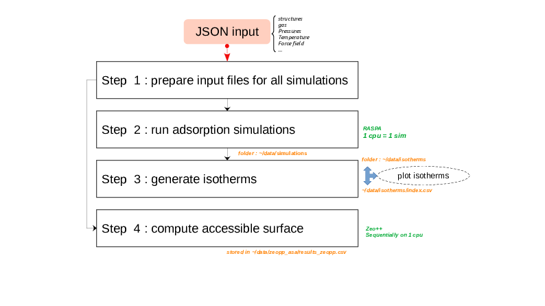

# simple-adsorption-workflow

Automating RASPA simulations and analysis for adsorption studies using a simple workflow with JSON input, CoRE MOF database integration, and isotherm generation.

## Description

This program provides a simple workflow for automating RASPA simulations for adsorption studies. It allows users to specify simulation parameters and default settings through a JSON file, and generates directories with input and running files for RASPA. The program retrieves CIF files from the CoRE MOF database and stores isotherms as CSV files. The workflow aims to streamline the simulations and simplify the modeling process, making it easier to study adsorption phenomena.

Some code is heavily inspired by [RASPA python wrapper](https://github.com/WilmerLab/raspa2/tree/sensor_array_mof_adsorption/python) and has been adapted to meet the specific needs of this program.


## Install

- Use a conda environment with python 3 :
```bash
conda create -n simple-adsorption-workflow python=3.9
```

- Install requirements in the conda environment :
```bash
conda activate simple-adsorption-workflow
pip install -r requirements.txt
```

- Install Zeo++

Download and compile Zeo++ at http://www.zeoplusplus.org/download.html.
Remember the path to the directory containing the executable ```network``` by mofying the corresponding line in `set_environment` :
```
export ZEO_DIR=/opt/zeo++-0.3
```


- Define the environment variables :
```bash
source set_environment
```

To recover the environment variables at each activation of the conda environment :

```bash
mkdir -p $CONDA_PREFIX/etc/conda/activate.d/
printf "%s\n" "#/bin/sh" "source $PWD/set_environment" > $CONDA_PREFIX/etc/conda/activate.d/simple-adsorption-workflow_set_env.sh
chmod +x $CONDA_PREFIX/etc/conda/activate.d/simple-adsorption-workflow_set_env.sh
```


## User input (JSON file)

```
{
    "parameters":
        {
        "structure":["KAXQIL"],
        "molecule_name": ["N2", "methane"],
        "pressure": [10,1E6],
        "npoints":5,
        "temperature": [298.15]
        }
        ,
    "defaults":
        {
            "unit_cells":[1,1,1],
            "FF":"GenericMOFs"
        }
}
```
In this example, the user can modify parameters and default parameters for RASPA simulations. The required specifications are as follows:

- A six-letter CSD code to identify the material (e.g., `KAXQIL`).
- Selection of a guest molecule using molecule_name (e.g., `methane`).
- Setting the temperature (`temperature`).
- Specifying a pressure range with two values (`pressures`): minimum and maximum pressure.
- Determining the number of points to calculate on the isotherm (`npoints`).

> Note : `parameters` and `defaults` have been divided for the following purpose : if there are lists of parameters in the `parameters` field (e.g., multiple materials), the program will generate simulation folders for each unique combination of `parameters`.

In this workflow, there are certain restrictions in order to keep the simulations simple and make some assumptions:
- The material must be available in the CoreMOF database, accessible through the MOFXDB database (https://github.com/n8ta/mofdb-client).
- The guest molecule should be a rare gas such as argon (Ar) or xenon (Xe), or it should have a spherical model, like nitrogen (N2), methane (CH4), or sulfur hexafluoride (SF6).
- No electrostatic interactions are considered in the simulations.

These restrictions and assumptions aim to streamline the simulations and simplify the modeling process.

## Workflow example
```Bash
python $PACKAGE/example-workflow-adsorption.py
```
To specify input and output locations :
```bash
python $PACKAGE/example-workflow-adsorption.py -i path/to/myinput.json -o path/to/data/directory
```
By default, the output data is written to the current directory (`./data`) and the input file should be placed in the root directory (`./data/input.json`).

<p align="center">
  
</p>
<p align="center"><i>Diagram of the workflow</i></p>

## Tests

To test the workflow on a local machine, use the `-t` flag : 
```bash
python $PACKAGE/example_adsorption_workflow.py -t
```

By default, the output directory is `./tests` and the input file is located in the github repository (`$PACKAGE/tests/test_isotherms/input.json`).

## Development todo lists

- [x] step 1 : Returns a set of directories with input and running files for RASPA. 
Default directory : `./data/simulations/`.
Internally, the program will search for the CIF files corresponding to the material name(s) in the MOFXDB database, and will choose the version corresponding to CoRE MOF 2019. 
Default directory : `./data/cif/`

- [x] step 2 : Run adsorption simulations
    - [x] on a local machine : using the bash script `/data/job.sh`.

    - [ ] on a HPC machine : using a job manager (e.g.SLURM).
    (to be discussed with SIMAP/GRICAD)

- [x] step 3 : Generate isotherms and store them in `./data/isotherms/` as CSV files. Each isotherm is associated to a unique identifier `isokey` and corresponding information are given in `index.csv`.

- [x] Find the cif file(s) in CoRE MOF from its six-letter CSD code
e.g : `python src/download_cif_from_mofxdb.py KAXQIL`

> Note : The search is fetched using the MOFX-DB API, it returns all mofs for which part of the name matches with the input keyword.
- [x] Create a simple workflow in a python script `example-workflow-adsorption.py` based on RASPA2 python wrapper
- [x] Create a json input file and document its format
- [x] Parse the json input in the workflow and check the creation of the input files for RASPA
- [x] Merge the two scripts that download for cif files and include them in the main program `example-workflow-adsorption.py`
- [x] Calculate in a function the minimal supercell.
- [x] Add an option to `src.wraspas2.create_script()` to write the result directly in a file 
- [x] Python notebook for plotting an isotherm
- [x] Add a function to check RASPA outputs `src.convert_data.output_isotherms_to_csv()`
- [x] Add an index file created with the data directories, in order to store the parameters of each simulation
- [x] Add a script to store isotherms in CSV format
- [x] Step 4 : Compute Accessible Surface Are (ASA) from the crystallographic structure with Zeo++
- [x] Add a test to verify the isotherms have been recovered from simulation outputs
## To do (Optional)

- [x] Optional : Download cif directly from the CSD database. It requires the installation of the CSD API in the environment.
- [ ] Download all cifs files given a material name
- [ ] Add to the workflow a step to select the minimum unit cell in order to avoid the bias from periodic boundary conditions. In practice, one runs a RASPA simulation with all defaults parameters and 0 steps, it then returns some basic information, like the perpendicular lengths which could be used to define the minimal supercell. 


## For future development

### CSD Python API

> Note : A local installation of the CSD Python API (under license) is needed to go further. One need first to log in at :
https://www.ccdc.cam.ac.uk/support-and-resources/csdsdownloads/
then download the CSD Python API.

The following commands allow to access the CSD API to the current python environment.


Source : https://fd-test.ccdc.cam.ac.uk/media/Documentation/1DBA2AB9-9DC7-423C-8EC9-9291D9C220DA/2020_CSD_Python_API_installation.pdf
* Add the `conda-forge` channel
* Install using the absolute path where the ccdc API is located (downloaded through the entire suite as mentioned above)
* Let your system read the installation paths
```Bash
conda config --add channels conda-forge
conda config --set channel_priority strict
conda install -c <PATH_TO_PYTHON_API> simple-adsorption-workflow #e.g.:/opt/CCDC/Python_API_2022/ccdc_conda_channel simple-adsorption-workflow
conda env config vars set CSDHOME=<PATH_TO_CSD> #e.g.:/opt/CCDC/CSD_2022
```

> NOTE : solving the environment can take a few minutes due to the number of dependencies to satisfy.

### Environment settings in fish shell

```bash
conda activate simple-adsorption-workflow
source set_environment_fish
```

To recover the environment variables at each activation of the conda environment :
```bash
mkdir -p $CONDA_PREFIX/etc/conda/activate.d/
printf "%s\n" "source $PWD/set_environment_fish" > $CONDA_PREFIX/etc/conda/activate.d/simple-adsorption-workflow_set_env.fish
chmod +x $CONDA_PREFIX/etc/conda/activate.d/simple-adsorption-workflow_set_env.fish
```