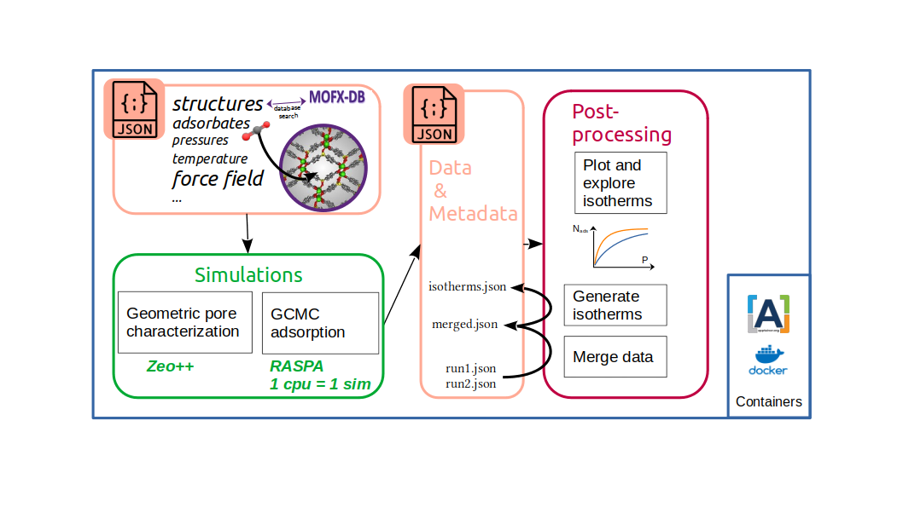

# simple-adsorption-workflow

Automating RASPA simulations and analysis for adsorption studies using a minimalist workflow with JSON input/output, CoRE MOF database integration, isotherm generation, prospecting tools and plot examples.

## Description

This package provides a demonstrative workflow for automating RASPA simulations for adsorption studies. It allows users to specify simulation parameters and default settings through a JSON file, and generates directories with input files and submission scripts for RASPA. The program retrieves CIF files from the CoRE MOF database and stores isotherms as CSV or JSON files. This workflow aims to streamline the simulations and simplify the analysis process, making it easier to study adsorption phenomena.

Part of the code presented here was heavily inspired by [RASPA python wrapper](https://github.com/WilmerLab/raspa2/tree/sensor_array_mof_adsorption/python), and been adapted to meet the workflow architecture.


## Install

### With Conda

- Create a conda environment with Python 3.9:
```bash
conda create -n simple-adsorption-workflow python=3.9
```

- Use pip to install the libraries listed in `requirements.txt` in the conda environment:
```bash
conda activate simple-adsorption-workflow
pip install -r requirements.txt
```

- Download and compile Zeo++ at [http://www.zeoplusplus.org/download.html](http://www.zeoplusplus.org/download.html). To inform the workflow of the executable `network`s path, modify the corresponding line in `set_environment`:
```
export ZEO_DIR=/opt/zeo++-0.3
```

- Define the environment variables:
```bash
source set_environment
```

Optionally, you can set up this recovering of the environment variables at each activation of the conda environment:

```bash
mkdir -p $CONDA_PREFIX/etc/conda/activate.d/
printf "%s\n" "#/bin/sh" "source $PWD/set_environment" > $CONDA_PREFIX/etc/conda/activate.d/simple-adsorption-workflow_set_env.sh
chmod +x $CONDA_PREFIX/etc/conda/activate.d/simple-adsorption-workflow_set_env.sh
```

In the case you are running in a fish shell, `set_environment_fish` should be used  in the commands above instead of `set_environment`.

### With Docker

A already configured Docker image is provided, and can be mounted via
**... ??? Expand on that ???**

## User input (JSON file)

This is the standard format of the `input.json` file to be provided by the user:

```
{
    "parameters":
        {
        "structure":["KAXQIL"],
        "molecule_name": ["N2", "methane"],
        "pressure": [10,1E6],
        "npoints":5,
        "temperature": [298.15]
        }
        ,
    "defaults":
        {
            "unit_cells":[1,1,1],
            "FF":"GenericMOFs"
        }
}
```
In this example, the user can modify parameters and default parameters for RASPA simulations. The required specifications are as follows:

- A six-letter CSD code to identify the material (e.g., `KAXQIL`).
- Selection of a guest molecule using molecule_name (e.g., `methane`).
- Setting the temperature (`temperature`).
- Specifying a pressure range with two values (`pressures`): minimum and maximum pressure.
- Determining the number of points to calculate on the isotherm (`npoints`).

> Note : `parameters` and `defaults` have been divided for the following purpose : if there are lists of parameters in the `parameters` field (e.g., multiple materials), the program will generate simulation folders for each unique combination of `parameters`.


In this workflow, there are certain restrictions in order to keep the simulations simple and make some assumptions:
- The material must be available in the CoreMOF database, accessible through the MOFXDB database (https://github.com/n8ta/mofdb-client).
- The guest molecule should be a rare gas such as argon (Ar) or xenon (Xe), or it should have a spherical model, like nitrogen (N2), methane (CH4), or sulfur hexafluoride (SF6).
- No electrostatic interactions are considered in the simulations.

These restrictions and assumptions aim to streamline the simulations and simplify the modeling process.

## Workflow example
```Bash
python $PACKAGE_DIR/example_adsorption_workflow.py
```
To specify input and output locations :
```bash
python $PACKAGE_DIR/example_adsorption_workflow.py -i path/to/myinput.json -o path/to/data/directory
```
By default, when the flag `-o` is not provided,   a new directory will be created with the following formatting name : `./<Date>_<Time>_<Runtype>/` .
The run type <Runtype> is `data` for normal runs and `<name_of_test>` for tests cases.

The schematic diagram (Fig. 1) outlines the primary functions executed within the workflow:

- **Parsing Input File:** The input file undergoes parsing and interpretation to generate simulation input files. Error messages are generated if the structure names are not found in the database or if gas names do not match the default ones in RASPA.

- **Calculations:** Two types of calculations are performed:
  - Grand Canonical Monte Carlo simulations using RASPA.
  - Pore characterization of the structures using Zeo++.

- **Storage of Output Data:** The resulting gas uptakes, along with input data and metadata from RASPA, are stored in a common `run<runID>.json` file.

- **Data Transformation:** Output data can be converted into more user-friendly array-like tables, facilitating the plotting of isotherms.

- **Data Merging:** Various workflow outputs can be merged, enabling the retrieval of isotherms based on group selections using both data and metadata.

  
<p align="center">
  
</p>
<p align="center"><i>Figure 1: Diagram of the workflow. </i></p>

## Tests

### Recover isotherms from CSV : `--test-isotherm-csv`

It runs 20 simulations on RASPA and compute geometric features using ZEO++, then stores the results in CSV files. It then reconstructs the isotherms curves from the simulation results and compares line by line all isotherms files from pre-computed data found in the package repository. The geometrical features are also stored in a CSV format, and 
To run it, use `-t` or `--test-isotherms-csv` flags: 
```bash
python $PACKAGE_DIR/example_adsorption_workflow.py -t
```
The input file used here is located in `$PACKAGE_DIR/tests/test_isotherms_csv/`.

### Recover isotherms from JSON : `--test-isotherm-json`

It runs 20 simulations on RASPA then stores the results in a single JSON file. It then reconstructs the isotherms and store the results in JSON format.

To run it, use the `-t2` or `--test-isotherm-json` flag : 
```bash
python $PACKAGE_DIR/example_adsorption_workflow.py -t2
```
The input file used here is located in `$PACKAGE_DIR/tests/test_isotherms_json/`.

### Merge and plot isotherms from two workflow runs : `--test-merge-json`

To run it, use the `-t3` or `--test-merge-json` flag : 
```bash
python $PACKAGE_DIR/example_adsorption_workflow.py -t3
```
The json files containing the data to be merged (single pressure data points) are located in `$PACKAGE_DIR/tests/test_merge_json/simulations/`.

### Documentation

#### JSON input

- `molecule_name` : the name of the gas molecule. 
By default, the force field for small molecules is TraPPE. Therefore a file of the same name must exist in `$RASPA_PARENT_DIR/share/raspa/molecules/TraPPE`.
- others parameters in section `defaults` : all other parameters that can be modified through a template.
  The workflow uses by default the following template for RASPA inputs, all keys in brackets can be modified from JSON input file.
template :
```
SimulationType                {simulation_type}
NumberOfCycles                {cycles}
NumberOfInitializationCycles  {init_cycles}
PrintEvery                    {print_every}
RestartFile                   no

Forcefield                    {forcefield}
CutOff                        12.8
ChargeMethod                  Ewald
EwaldPrecision                1e-6
UseChargesFromMOLFile         {is_mol}

Framework                     0
FrameworkName                 {structure}
InputFileType                 {input_file_type}
UnitCells                     {a} {b} {c}
HeliumVoidFraction            {helium_void_fraction}
ExternalTemperature           {temperature}
ExternalPressure              {pressure}

Movies                        no
WriteMoviesEvery              100

Component 0 MoleculeName             {molecule_name}
            StartingBead             0
            MoleculeDefinition       TraPPE
            IdealGasRosenbluthWeight 1.0
            TranslationProbability   1.0
            RotationProbability      1.0
            ReinsertionProbability   1.0
            SwapProbability          1.0
            CreateNumberOfMolecules  0
```
Definitions :
- `{molecule_name}`: The molecule to test for adsorption. A file of the same name must exist in `$RASPA_PARENT_DIR/share/raspa/molecules/TraPPE`.
- `{temperature}`: The temperature of the simulation, in Kelvin.
- `{pressure}`: The pressure of the simulation, in Pascals.
- `{helium_void_fraction}`: The helium void fraction of the input structure. Required for excess adsorption back-calculation.
- `{unit_cells}`: The number of unit cells to use, by dimension.
- `{simulation_type}`: The type of simulation to run, defaults to "MonteCarlo".
- `{cycles}`: The number of simulation cycles to run.
- `{init_cycles}`: The number of initialization cycles to run. Defaults to the minimum of cycles / 2 and 10,000.
- `{forcefield}`: The forcefield to use. Name must match a folder in `$RASPA_DIR/share/raspa/forcefield`, which contains the properly named `.def` files.
- `{input_file_type}`: The type of input structure. Assumes cif.

> Note : In the future, we might let the user provide its own custom templates files to be able to take into account other parameters.

### What can not be done (yet) with `simple-adsorption-workflow` ?

- Use user-provided CIF structure files: several verification must be performed to use a new CIF in a GCMC simulation which is out of the scope of the present tool (curate CIF, check presence of force field parameters for the new atoms name defined, ...)
- Use partial charges (calculated automatically or found in MOF databases) to set the electrostatic interations between atoms. This is a major limitations, which will be solved in the close future.

